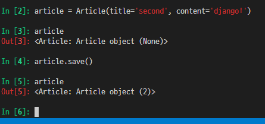

# CharField(max_length=None)

* 길이의 제한이 있는 문자열을 넣을 때 사용
* max_length가 필수인자
* 필드의 최대 길이, 데이터베이스와 django의 유효성검사에서 사용
* input type text


# TextField()

* 글자의 수가 많을 때 사용, 길이 제한 없다.
* textarea


# DateTimeField()

* 최초 생성일자: `auto_now_add=True`
  * django ORM이 최초 데이터 입력시에만 현재 날짜와 시간으로 갱신
  * 테이블에 어떤 데이터를 최초로 넣을 때 들어가는 값
* 최종 수정 일자: `auto_now=True`
  * django ORM이 save를 할 때마다 현재 날짜와 시간으로 갱신


# Migrations

### makemigrations

* 모델을 변경한 것에 기반한 새로운 마이그레이션(설계도)을 만들 때 사용
* 모델을 활성화하기 전에 DB 설계도를 작성
* 생성된 마이그레이션 파일은 데이터베이스 스키마를 위한 버전관리 시스템이라고 생각
* `python manage.py makemigrations`


### migrate

* 작성된 마이그레이션 파일들을 기반으로 실제 DB에 반영
* db.sqlite3라는 데이터베이스 파일에 테이블을 생성
* 모델에서의 변경 사항들과 DB의 스키마가 동기화를 이룸
* `python manage.py migrate`


### sqlmigrate

* 해당 마이그레이션 파일이 SQL문으로 어떻게 해석되어서 동작할지 미리 확인하기 위한 명령어
* `python manage.py sqlmigrate articles 0001`


### showmigrations

*  마이그레이션 파일들의 migrate 여부를 확인하기 위한 명령어
* `python manage.py showmigrations`


# Model의 중요 3단계

1. models.py : 변경사항(작성, 수정, 삭제) 발생
2. makemigrations:  마이그레이션(설계도) 만들기
3. migrate : DB에 적용


# Model

* DB에 데이터를 저장하고 가져오는 것

* SQL

* ORM(통역기) Object-Relational-Mapping

  * 쿼리를 python에서 object로 사용할 수 있게 해준다.

  

### 모델 정의

* `models.py`에 모델 클래스를 정의해서 사용할 수 있다.

  * class 테이블명(models.Model):

    ​	title(인스턴스) = models.CharField(models의 클래스)(max_length=100)

  * 자주 사용하는 필드명

    * CharField / DateTimeField / TextField / IntegerField / ImageField / FloatField / BooleanField / ...


### DB 생성

* 클래스를 다 정의하면 반드시 해야만 하는 일

  * makemigrations
    * python manage.py makemigrations app이름
    * DB에 적용하기 위한 설계도를 제작
    * app 이름을 뒤에 적으면 해당 app에 있는 models.py의 내용만 설계도를 만듦
  * migrate
    * python manage.py migrate app이름
    * 만들어진 설계도를 가지고 DB에 테이블을 생성
    * app 이름을 적으면 해당 app에 있는 migration 파일을 db에 적용시킨다.
  * showmigrations
  * sqlmigrate
    * `python manage.py sqlmigrate articles 0001`

  

### DB 사용

* DB api

  ```
  모델클래스이름.objects.QuerySetAPI
  
  Article.objects.all()
  * object가 아니고 objects임을 주의하자!
  ```

  

# CREATE

`pip install ipython django-extensions`

`python manage.py shell_plus`

데이터를 작성하는 3가지 방법

1. 첫번째 방법

   

   * `article = Articles() : 모델 클래스로부터 인스턴스 생성
   * article 인스턴스로 클래스 변수에 접근해 해당 인스턴스 변수를 변경
   * save() method 실행

2. 두번째 방법

   

   * 클래스로 인스턴스 생성시 keword 인자를 함께 작성
   * `article = Article(title='second', content='django!')`
   * article.save() 메서드 호출 -> db에 실제 저장

3. 세번째 방법

   

   * create() 메서드를 사용하면 쿼리셋 객체를 생성하고 save하는 로직이 한번의 step으로 가능
   * `Article.objects.create(title='third', content='django!!')`


# READ

`all()`

* QuerySet return
* 리스트는 아니지만 리스트와 거의 비슷하게 동작(조작할 수 있음)


`get()`

* 객체가 없으면 `DoesNotExist` 에러가 발생
* 객체가 여러개일 경우는 `MultipleObjectReturned`에러가 발생
* 위와 같은 특징을 가지고 있기 때문에 unique 혹은 Not Null 특징을 가지고 있으면 사용할 수 있다.(pk)


`filter()`

* 지정된 조회 매개 변수와 일치하는 객체를 포함하는 QuerySet을 리턴
* 조건에 맞는 객체가 없어도 빈 쿼리셋을 리턴(Null이 아니다!!! 주의!!!)


# UPDATE

몇번 글 수정할 거야?

뭐를 수정할거야?

저장해 .save()


# DELETE

뭐 삭제할거야?

.delete()

1, 2, 3번이 있을때 1번을 삭제하고 새로 객체를 만들면 1번이 아니라 4번으로 생성됨!!!


# admin

`python manage.py createsuperuser`

admin을 이용해서 CRUD를 편하게 할 수 있다.


반드시 DB를 구축해 놓고 superuser를 만들어야 한다.(테이블이 있어야 superuser정보를 저장가능)