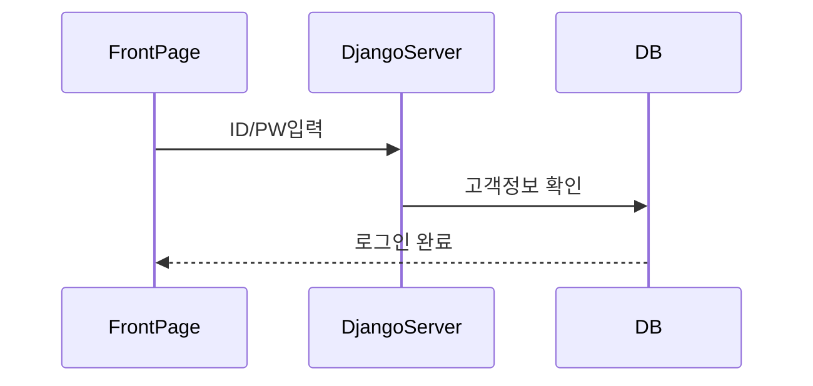
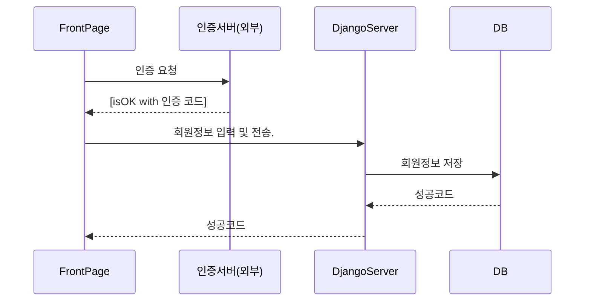
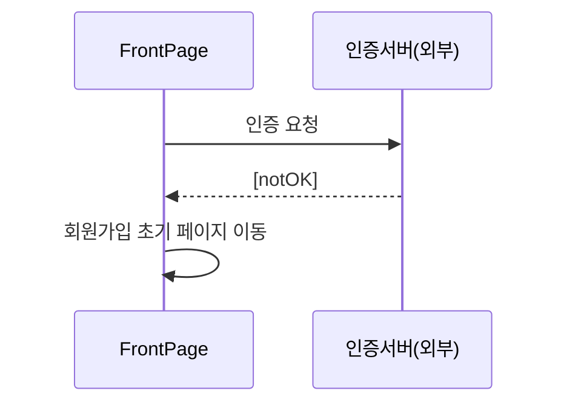
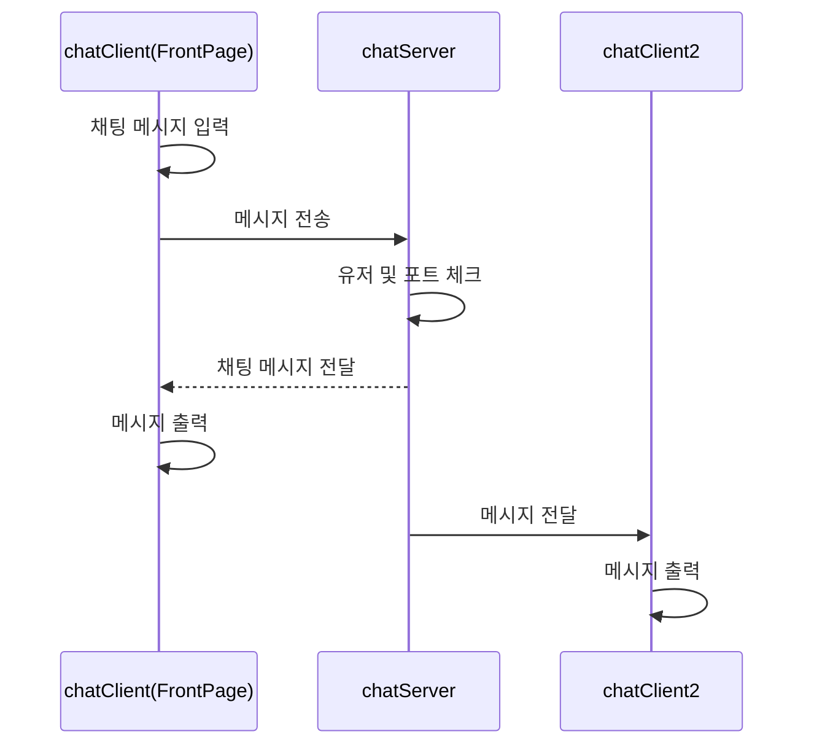

# Project 명 

## 1. 로그인

로그인은 간단하게 ID, PW 입력을 통해 DB를 확인하여 로그인을 진행

```mermaid
sequenceDiagram

FrontPage->>DjangoServer:ID/PW입력
DjangoServer->>DB : 고객정보 확인
DB -->> FrontPage: 로그인 완료

```

## 2. 회원 가입

실명 인증은 별도의 실명 인증 서버를 거쳐 OK를 받으면 저장한다. 

#### 인증 성공의 경우

```mermaid
sequenceDiagram

FrontPage ->> 인증서버(외부) : 인증 요청

인증서버(외부) -->> FrontPage : [isOK with 인증 코드]
FrontPage ->> DjangoServer : 회원정보 입력 및 전송. 

DjangoServer ->> DB : 회원정보 저장
DB -->> DjangoServer : 성공코드
DjangoServer -->> FrontPage : 성공코드


```

#### 인증 실패의 경우

```mermaid
sequenceDiagram

FrontPage ->> 인증서버(외부) : 인증 요청
인증서버(외부) -->> FrontPage : [notOK]
FrontPage ->> FrontPage : 회원가입 초기 페이지 이동
```

## 3. 채팅

채팅 서버는 별도의 채팅 서버를 거쳐 서비스 된다.

```mermaid
sequenceDiagram

chatClient(FrontPage) ->> chatClient(FrontPage): 채팅 메시지 입력
chatClient(FrontPage) ->> chatServer : 메시지 전송
chatServer ->> chatServer : 유저 및 포트 체크
chatServer -->> chatClient(FrontPage) : 채팅 메시지 전달
chatClient(FrontPage) ->> chatClient(FrontPage) : 메시지 출력
chatServer ->> chatClient2 : 메시지 전달
chatClient2 ->> chatClient2 : 메시지 출력

```

