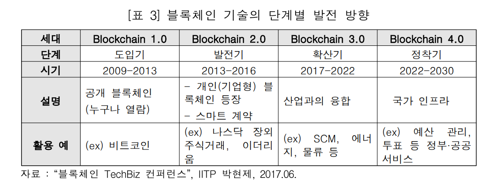

[TOC]

# 블록체인 기술의 활용 전망

## - 블록체인의 부상

* 거래 데이터를 분산 저장하고 위, 변조를 방지하여 신뢰를 보장하는 블록체인은 세상을 변화시킬 기술로 전망되고 있음

  * 블록체인은 거래정보(Transaction)를 저장한 블록을 모든 구성원(Peer/Node)이 네트워크를 통해 분산 저장하고 일정 시간마다 암호화 후 체인 형태로 연결 하여 저장하는 기술

    * 제3자의 신뢰 없이 이중 거래를 차단하여 확실하고 안전한 거래를 보장하는 특성을 가짐
    * 블록체인 기술의 핵심 특징 : **신뢰성, 무결성, 투명성**

    

  * 블록체인이나 분산원장 기술에 대한 기대감이 점차 높아지고 있으며 향후 5-10년 내 실제 적용 가능성이 높을 것으로 예측됨

    * 시장 조사 기관 가트너(Gartner)는 블록체인의 연간 성장률을 2020년 기준 120%로 예상하며 사업적 부가가치는 2030년에는 3조 달러를 초과할 것으로 예측

    

  * 세계경제포럼(WEF)은 2027년 기준 전 세계 GDP의 10%인 8조 달러가 블록 체인 플랫폼에서 발생할 것으로 전망하고 있음

    

## - 기술 소개 및 발전 방향

1. 블록체인 기술 소개

   * 블록체인 기술은 공개 블록체인으로 정의할 수 있는 비트코인에서 시작
     * 블록체인은 2009년 개발된 비트코인의 기반 기술로 중개자 없이 암호화 기술과 P2P 기반 분산 원장 등을 통해 안전하게 거래를 할 수 있음
     * 2008년 10월 **사토시 나카모토**라는 가명을 가진 개발자가 작성한 비트코인 논문에 의해 소개되었으며 2009년 1월에 구현된 SW 공개
     * 비트코인(Bitcoin)은 암호화 기술과 P2P 분산 네트워크 기반 타임스탬프 서버를 이용하여 이중지불 문제를 해결하여 제3의 신용기관 없이 개인 간 직접적인 거래가 가능하게 함 

   

   

   * 블록을 추가하기 위해서는 각 노드 간 합의 알고리즘을 통해 원장에 기록될 데이터를 검증(validate)하는 작업증명 과정과 이후 생성된 블록의 유효성을 검증하는 단계가 필요
     * 신뢰할 수 있는 블록을 생성하기 위해 채굴(Mining)이라는 과정이 필요하며 비트코인은 작업증명(PoW)방식을 활용, 채굴에 성공하면 보상이 주어짐
     *  생성된 후보 블록은 네트워크 내 참여자들에게 전송되어 유효성 검증을 거쳐 이전 블록과 연결됨

   

   

   * **블록체인 종류는 공개(Public), 개인(Private), 컨소시엄(Hybrid, 하이브리드) 블록체인 3가지로 크게 구분 가능**

   

2. 블록체인 기술의 발전 방향

   * 블록체인 기술은 공개 형태에서 확장성과 효율성을 보완한 개인 블록체인으로 발전하였으며 향후 산업간 융합과 사회 기반구조로써 활용될 것으로 보임

   

## - 분야별 활용 전망

* 블록체인 기술은 중앙기관에 의한 신뢰 비용이나 역할이 큰 산업 영역에 적용 하는 경우, 효율성 증대와 관리 비용 절감효과를 가져올 것으로 기대

### - 물류, 유통분야

* 위변조 불가능한 속성과 투명성을 가진 블록체인을 활용하면 실시간 가시성을 제고하고 서류·행정 처리 비용과 처리시간을 감소

* **(실시간 가시성 제고로 산업 경쟁력 강화)** 블록체인을 활용한 공급망(Supply chain)은 제품의 이동 진행 상황에 대한 실시간 가시성 제고로 업무 효율성을 향상하고 최적의 재고를 보유할 수 있게 됨

  * 공급체인 생태계의 각 참여자(송하인, 포워더, 세관원, 수화인 등)는 블록 체인으로 문서를 공유하는 경우, 어느 기관에서든지 현 상태를 파악 가능

  

  

  

* **(투명성 제고로 분쟁 문제 해결 가속화)** 효율적인 실시간 정보 교류와 투명성 으로 인해 물류 안전과 보안체계를 견고화하고 문제 해결 시간을 줄여줌

  * 위변조 불가능한 투명성으로 인해 거래 시 발생할 수 있는 오류나 사기가 감소 하고 기존의 문서 교환 방식의 부정확성으로 발생하는 분쟁을 빠르게 식별 가능하여 해결 시간 감소

  

### - 에너지 분야

* 블록체인의 분산원장 기술과 스마트 계약 기능은 전력거래소 없이도 누구나 에너지를 생산하고 판매, 소비할 수 있을 것으로 전망되며 신재생 전자화폐, 전력 거래 및 청산 등에도 블록체인 응용이 가능함
* **(투명한 에너지 거래)** 블록체인 기술을 에너지 분야에 적용하면 생산과 판매, 소비 등 거래가 투명하게 이루어질 수 있음
* **(신재생 에너지 거래에 적합)** 블록체인 기술은 마이크로 그리드(micro grid) 형태의 신재생 에너지의 거래에 적합함

### - 의료 분야

* **(기대효과)** 민감정보인 의료데이터의 수집, 저장 및 공유·활용 과정에서 신뢰성, 보안성 문제를 해결하여 의료 분야 발전의 가속화 가능
* **(건강정보 통합관리)** 개인을 중심으로 늘어나는 민감 정보인 건강데이터를 탈중앙화된 블록체인 기술을 활용하여 통합 관리하여 지속적인 치료 및 맞춤형 진료를 위한 통합관리 기반 마련

* **(의료정보의 투명한 활용)** 블록체인을 기반으로 비식별화 처리된 의료정보의 안전하고 투명한 활용을 증명할 수 있다면 활용성이 확대될 것으로 예상
* **(개인정보보호와 보안성 강화)** 파급효과가 심각한 의료 정보의 보안 침해 사고는 블록체인을 통한 보안성 강화로 해결 가능

### - 정부 공공 서비스 분야

* **(기대효과)** 블록체인 기술은 복지, 기부금 관리, 선거 및 여론조사, 조세 관리 등 정부와 공공 서비스 분야에서 투명성과 신뢰 확보 및 보안성 강화

  * **(복지)** 스마트 계약으로 실수를 미리 방지하고 업무처리 효율화 및 부정 수급 문제를 해결하고 공유하여 신뢰도와 투명성 제고

  * **(기부금 관리)** 간편 결제 서비스와 블록체인 기술의 융합은 기부금 관리 단체의 운영 효율성과 투명성을 높여 기부에 대한 신뢰도를 높여 지속가능성을 높일 수 있음

  * **(선거, 여론조사)** 각종 여론조사나 정부 및 지자체의 공공 선거에 이르기까지 조작을 할 수 없고 보안성을 강화한 시스템 구축 가능

    

  * **(세금 및 예산 관리)** 블록체인을 활용하면 지방자치단체 등의 예산 할당 내용 부터 지출 내역을 실시간으로 공유할 수 있고 스마트 계약을 통해 지출 내역을 관리하면 관련 행정 부담이 감소하며 투명성이 제고

  * **(공공데이터 및 자산관리)** 공공데이터의 보안성을 강화하고 투명한 활용을 촉진하며 부동산 거래/등기와 같은 자산관리와 전자계약은 스마트 계약을 활용하여 중개 비용과 시간이 절감됨

    

## - Quiz

### 1) 블록체인 기술의 핵심 특징 3가지는 무엇일까요?

* 정답 : 신뢰성, 투명성, 무결성

### 2) 블록체인의 종류 3가지는 무엇일까요?

* 정답 : 공개블록체인, 개인블록체인, 컨소시엄(하이브리드)블록체인

## - 참고자료

* 금융위원회, 블록체인기술 금융분야 도입방안을 위한 연구
* 2016 박현제(IITP), 블록체인 TechBiz 컨퍼런 ‘17 블록체인R&D 추진현황, 2017 
* 임명환, 블록체인 기술의 활용과 전망, 2016
* SPRi 이슈리포트 제2017-004호 블록체인 기술의 산업적, 사회적 활용 전망 및 시사점

